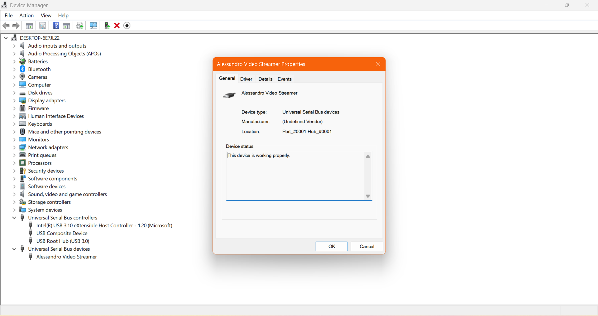
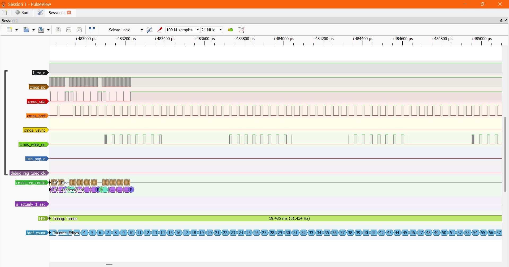

# Gowin_FPGA_CV

## Project Overview
This project implements a high-performance camera streaming system using the Gowin Tang Primer 20k FPGA. The system captures video from an OV5640 camera module and provides dual output streams:

- **HDMI Output**: Real-time video display on external monitors/TVs
- **USB 2.0 High-Speed Streaming**: Up to 40 MB/s data transfer to PC

### Current Capabilities
- **Camera**: OV5640 sensor capturing 640×480 resolution at 51.45 FPS
- **Video Format**: RGB565 color encoding
- **HDMI Display**: Real-time video output with TMDS encoding
- **USB Streaming**: High-speed bulk transfer mode achieving up to 40 MB/s throughput
- **Frame Synchronization**: Precise timing control with vsync-based frame boundary detection
- **DDR3 Buffer**: Triple frame buffering for smooth video processing

## Demo Video


*Demo showing the FPGA streaming video simultaneously to both PC (via USB) and Television (via HDMI)*

**Note**: For higher quality video, you can [download the full MP4 version here](images/StreamerDemo_lite.mp4).

## System Screenshots

### USB Device Recognition


*Windows Device Manager showing the FPGA recognized as a USB 2.0 high-speed device*

### Signal Analysis


*Logic analyzer capture showing camera timing signals and USB communication*

## Technical Specifications

### Hardware Platform
- **FPGA**: Gowin Tang Primer 20k (GW2A-LV18PG256C8/I7)
- **Camera**: OV5640 sensor module
- **Memory**: DDR3 interface for frame buffering
- **USB**: USB 3317 ULPI PHY for USB 2.0 high-speed communication
- **Display**: HDMI output via TMDS encoding

### Performance Metrics
- **Video Resolution**: 640×480 pixels
- **Frame Rate**: 51.45 FPS
- **Color Depth**: 16-bit RGB565
- **USB Throughput**: Up to 40 MB/s (320 Mbps)
- **USB Mode**: High-speed bulk transfer (480 Mbps theoretical)
- **Latency**: Real-time processing with triple frame buffering

**OV5640 Configuration**: The camera settings and output parameters are calculated using a custom Python script ([`ov5640_calculator.py`](CV_acceleration/src/OV5640/ov5640_calculator.py)) that predicts the final OV5640 output based on register configurations and timing parameters.

## OV5640 Configuration Analysis

```
OV5640 Configuration Analysis
============================================================

📡 CLOCK CONFIGURATION:
  Input Clock:                        24.0 MHz
  ─────────────────────────────────────────────────
  Register Values:
    0x3034 (Bit Div):            0x1A
    0x3035 (Sys/MIPI Div):       0x21
    0x3036 (PLL Multiplier):     0xA0
    0x3037 (PLL Pre/Root):       0x12
    0x3108 (PCLK/SCLK Div):      0x01
    0x3824 (DVP PCLK Div):       0x02
  ─────────────────────────────────────────────────
  Parsed Dividers:
    Bit Divider:                     2.5
    System Divider:                    2
    MIPI Divider:                      1
    PLL Multiplier:                  160
    PLL Pre-divider:                   2
    PLL Root Divider:                  2
    PCLK Divider:                      1
    SCLK Divider:                      1
    DVP PCLK Divider:                  2
  ─────────────────────────────────────────────────
  Calculation Steps:
    1. After Multiplier:            3840.0 MHz
    2. After Bit Div:               1536.0 MHz
    3. After Sys Div:                768.0 MHz
    4. After MIPI Div:               768.0 MHz
    5. After Pre Div:                384.0 MHz
    6. After Root Div:               192.0 MHz
    7. After PCLK Div:               192.0 MHz
    8. After SCLK Div:               192.0 MHz
    9. Final Pixel Clock:             96.0 MHz
  ─────────────────────────────────────────────────
  Verification:
    Direct Calculation:               96.0 MHz
    Calculations Match:           ✅

🖼️  RESOLUTION & BINNING:
  Sensor Window:      2624×1948
  Output Resolution:  640×480
  X Binning:          1:4
  Y Binning:          1:4
  ISP X Offset:       16
  ISP Y Offset:       6
  ─────────────────────────────
  Expected Width:     640.0
  Expected Height:    480.0
  Width Match:        ✅
  Height Match:       ✅

⏱️  FRAME TIMING:
  HTS (H Total):          1896 pixels
  VTS (V Total):           984 lines
  H Blanking:             1256 pixels
  V Blanking:              504 lines
  Total Pixels/Frame: 1,865,664
  ─────────────────────────────
  Frame Rate:           51.456 fps
  Line Time:             19.75 μs
  Frame Time:            19.43 ms

🔧 KEY REGISTER VALUES:
  0x3036: 0xA0  (PLL Multiplier)
  0x3037: 0x12  (PLL Pre/Root Divider)
  0x3035: 0x21  (System Clock Divider)
  0x3108: 0x01  (PCLK/SCLK Divider)
  0x380C: 0x07  (HTS High)
  0x380D: 0x68  (HTS Low)
  0x380E: 0x03  (VTS High)
  0x380F: 0xD8  (VTS Low)
  0x3808: 0x02  (Output Width High)
  0x3809: 0x80  (Output Width Low)
  0x380A: 0x01  (Output Height High)
  0x380B: 0xE0  (Output Height Low)
  0x3814: 0x31  (X Sample Increment)
  0x3815: 0x31  (Y Sample Increment)
```

*This analysis is generated by the [`ov5640_calculator.py`](CV_acceleration/src/OV5640/ov5640_calculator.py) script, which validates all timing calculations and register configurations.*

### Key Features
- Dual simultaneous video output (HDMI + USB)
- Frame-synchronized data streaming
- Automatic USB enumeration and configuration
- Real-time video processing pipeline
- FIFO-based data buffering with flow control
- Configurable frame boundary markers

## Development Setup

# VSC Extensions Needed
- eirikpre.systemverilog
  - Install: In VS Code, go to Extensions, search “SystemVerilog (eirikpre)”, install.
  - Enable format-on-save:
    - File → Preferences → Settings → search “format on save” → check “Editor: Format On Save”.
  - Set as default formatter for Verilog/SystemVerilog:
    - Open settings.json and add:
      {
        "[verilog]": {
          "editor.defaultFormatter": "eirikpre.systemverilog",
          "editor.formatOnSave": true
        },
        "[systemverilog]": {
          "editor.defaultFormatter": "eirikpre.systemverilog",
          "editor.formatOnSave": true
        }
      }

# Programs Needed
- verible-verilog-format and verible-verilog-lint (optional but recommended)
  - Download a Verible release for Windows (zip) and extract, e.g. to C:\verible.
  - Point the formatter to the absolute path (avoids PATH dependency):
    - In settings.json:
      "systemverilog.formatCommand": "C:/verible/verible-verilog-format.exe --line_terminator=LF --column_limit=500 --indentation_spaces=2 --assignment_statement_alignment=flush-left --case_items_alignment=flush-left --class_member_variable_alignment=flush-left --distribution_items_alignment=flush-left --enum_assignment_statement_alignment=flush-left --formal_parameters_alignment=flush-left --module_net_variable_alignment=flush-left --named_parameter_alignment=flush-left --named_port_alignment=flush-left --port_declarations_alignment=flush-left --struct_union_members_alignment=flush-left --try_wrap_long_lines=false --wrap_end_else_clauses=false"
  - Linting (optional): If you want lint diagnostics in VS Code, either:
    - Add C:\verible to PATH (see below), or
    - Configure the extension’s Verible Lint command explicitly (key name may vary by version), e.g.:
      "systemverilog.launchConfigurationVeribleLint": "C:/verible/verible-verilog-lint.exe --check_syntax --lint_fatal --parse_fatal --show_diagnostic_context --ruleset=default"

- Add C:\verible (or your Verible bin folder) to PATH environment variable
  - Windows: Win + R → sysdm.cpl → Advanced → Environment Variables…
  - Under “System variables” → Path → Edit → New → C:\verible → OK.
  - Close and reopen VS Code and terminals so they see the new PATH.
  - Verify in a new terminal:
    - verible-verilog-format --version
    - verible-verilog-lint --version

- Microsoft Visual C++ Redistributable (both x64 and x86)
  - Install the latest “Microsoft Visual C++ Redistributable” packages for x64 and x86 from Microsoft’s website.
  - These are required to run the prebuilt Verible executables.

# Recommendations
- Line endings: set LF
  - In VS Code, bottom-right selector → choose LF.
  - Optionally enforce in settings:
    - "files.eol": "\n",
    - "files.insertFinalNewline": true
  - Note: verible-verilog-format can force LF with --line_terminator=LF, but aligning the editor/repo prevents mixed line endings and avoids churn.